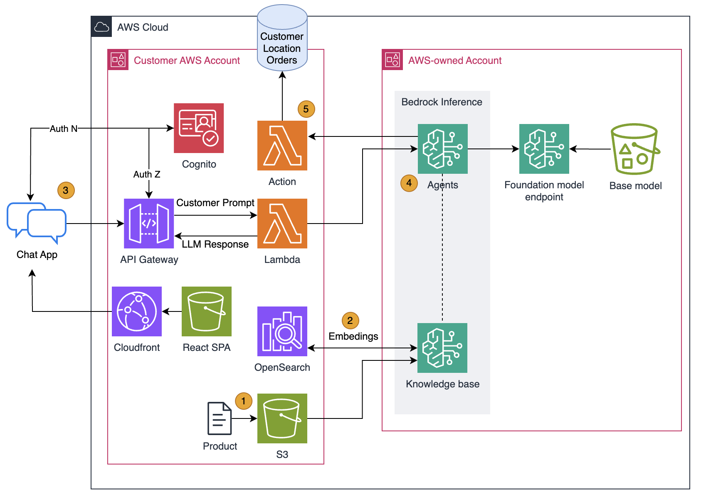
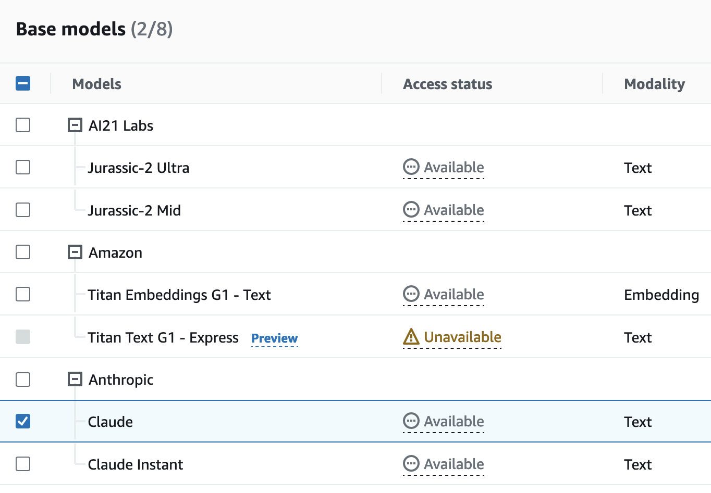

# Bedrock Agents Order Chatbot


## Overview
This is a fullstack Chatbot app that is able to help a customer find a new drink based on preferences such as calories, allergens, flavors, or seasonal trends. After a drink is found it will walk the customer through the order process and submit the order.  The Chatbot is able to surface recommendations via Bedrock Knowledge base using product data stored in S3. The Chatbot is also able to access known customer preferences from Datastore, find local store locations for pickup, and submit order to Commerce engine using Bedrock Agents. This is 100% Serverless and is well architected. Demo -> POC in a matter of hours!

Get started by cloning this project and deploying the whole stack or just the frontend and wire your own backend. This is a monorepo application (frontend/backend) that can be used as a Demo / POC for you to show customers the art of the possible.

## Features
- Simple React Frontend Template (Easily Configurable to meet customer brand image)
- Bedrock Agents integration (Lambda Actions Code)
- OpenAPI Pattern Example
- Vector DB via Knowledge Base (Just upload example file to S3 and sync)
- Secured Frontend and APIGateway via Cognito / JWT
- DynamoDB table for Orders
- Mock Integration of Customer Profile and Location data

## Requirements
* [Create an AWS account](https://portal.aws.amazon.com/gp/aws/developer/registration/index.html) if you do not already have one and log in. The IAM user that you use must have sufficient permissions to make necessary AWS service calls and manage AWS resources.
* [AWS CLI](https://docs.aws.amazon.com/cli/latest/userguide/install-cliv2.html) installed and configured
* [Git Installed](https://git-scm.com/book/en/v2/Getting-Started-Installing-Git)
* [AWS Serverless Application Model](https://docs.aws.amazon.com/serverless-application-model/latest/developerguide/serverless-sam-cli-install.html) (AWS SAM) installed
* [Node 18x](https://nodejs.org/en/blog/release/v18.18.1) for Frontend React Build

## Architecture


## 🛫 Deployment Instructions

### Backend Deployment
1. Create a new directory, navigate to that directory in a terminal and clone the GitHub repository:
    ``` bash
    git clone https://URL-HERE
    ```
2. Change directory to backend:
    ``` bash
    cd ./backend
    ```
3. From the command line, use AWS SAM to deploy the AWS resources for the backend as specified in the template.yaml file:
    ``` bash
    cd ./functions
    npm install
    cd ..
    sam build && sam deploy --guided
    ```
4. During the prompts:
    * Enter a stack name
    * Enter the desired AWS Region
    * Enter Bedrock Agent ID & Alias ID from Console
    * Enter Email for Cognito user creation (*Check email for password after*)
    * Allow SAM CLI to create IAM roles with the required permissions

    Once you have run `sam deploy --guided` mode once and saved arguments to a configuration file samconfig.toml, you can use `sam deploy` in future to use these defaults.
    <span style="color:yellow"> *The deployment can take up to 15 mins because of the setup needed for Cloudfront*</span>

5. <span style="color:red">*You must enable Amazon Bedrock models in your account and in the SAME REGION you have deployed your code.* </span> Navigate to [Amazon Bedrock Console](https://console.aws.amazon.com/bedrock/home#/modelaccess).

    Under Model Access click `Manage model Access` in the upper right.  Enable `Anthropic-Claude` & `Anthropic-Claude Instant` and click `Save changes` 

    


### Bedrock Knowledge base & Agents Setup

When setting up a Knowledge base in Bedrock use the example data [product.csv](./backend/product.csv) or supply your own

While setting up Bedrock Agent below is an example `Instructions for Agent`
```
You are an agent that helps customers purchase a drink. Retrieve customer details like customer ID, city, and likes based on the name. Provide first recommendation based on customer likes {likes}. Further recommendations are based on new customer preference prompt. Generate response with product name and calories. After customer indicates product they would like to order, use customer city {city} to get potential store locations. Confirm the store location. Confirm product name, product size, order total, and store location. Once confirmed, submit order with all required fields. On order success return confirmation message in format below. Your order {orderId} has been confirmed. Your drink will be ready in the next 5 mins at store {storeName}.
```
Here is the Example OpenAPI file to use [agents-openapi.json](./backend/openapi/agents-openapi.json)

Lambda to use will be named `{STACK NAME}-BedrockAgentsAction-{RANDOM STRING}`

### Frontend Deployment
After the backend resources have been deployed you have the option to run the Frontend React locally or build and deploy to S3 and access via Cloudfront.  There are two JavaScript files (`build-env.cjs` & `build-syncwebsite`) that will get required Environmental Variables and Deploy to correct S3 and invalidate Cloudfront.

#### Run React Locally
Navigate to root of the directory in a terminal and run following commands to fetch variables from AWS and run locally:

``` bash
npm install
npm run create-env
npm run dev
```

#### Build and Deploy to S3 / Cloudfront
Navigate to root of the directory in a terminal and run following command to fetch variables from AWS and deploy to Cloud:

``` bash
npm run sync-website
```

## 🛬 CleanUp
```bash
cd ./backend
sam delete
```

## React Frontend Customizations
### Navbar
* Navbar Logo, Links, and Buttons [navbar.jsx](./src/components/navbar.jsx)

### Background
* React App Container [App.jsx](./src/App.jsx)
* Background Image Location [background.jpg](./src/assets/background.jpg)


## 📓 Authors
Jacob Cravinho
@cravinho